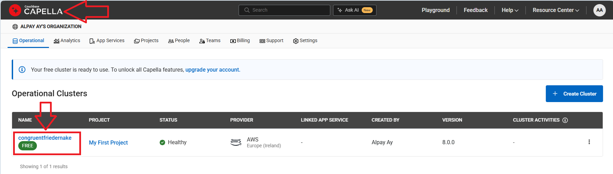

# Couchbase Shell AI Workshop
## From Simple Chat to RAG

Welcome! In this workshop, you'll build an AI-powered application using Couchbase Shell, starting with a simple chat request and evolving it into a RAG (Retrieval-Augmented Generation) system.

---

## What You'll Build

By the end of this workshop, you'll have:
1. A working connection to OpenAI's API
2. A Couchbase Capella database with vector search
3. A simple chat application
4. A RAG system that enhances responses with your own data

**Time Required**: ~60 minutes

---

## Part 1: Installation & Setup

In this section, you'll install all the necessary tools and set up your accounts. By the end, you'll have Couchbase Shell running on your machine, an OpenAI API key ready to use, and a free Couchbase Capella cluster in the cloud.

### Step 1.1: Install Couchbase Shell

We'll start by installing Couchbase Shell, which will be your command-line interface for interacting with both Couchbase and OpenAI throughout this workshop.

**macOS:**
```bash
brew install couchbase-shell
```

**Linux:**
```bash
# Download the latest release
wget https://github.com/couchbaselabs/couchbase-shell/releases/download/v1.1.0/cbsh-x86_64-unknown-linux-gnu.tar.gz
tar -xzf cbsh-x86_64-unknown-linux-gnu.tar.gz
sudo mv cbsh /usr/local/bin/
```

**Windows:**
```powershell
# Download from GitHub releases
# https://github.com/couchbaselabs/couchbase-shell/releases/download/v1.1.0/cbsh-x86_64-pc-windows-msvc.zip
# Extract and add to PATH
```

Verify installation:
```bash
cbsh --version
```
#### Step 1.2: Setup your AI API Key

Next, you'll create an AI API Key. This key allows your applications to access LLMs APIs to generate embeddings(vector representation of your content), and to start chat conversation. Right now [Couchbase Shell is compatible with OpenAI, Gemini and Bedrocks](https://couchbase.sh/docs/#_cb_env_llm).

#### Step 1.2.1: Get Your OpenAI API Key

To Create an OpenAI Key:

1. Go to https://platform.openai.com/api-keys
2. Sign up or log in
3. Click "Create new secret key"
4. Copy your key (starts with `sk-`)

**Set your OpenAI API key:**
```bash
# macOS/Linux
export OPENAI_API_KEY="sk-your-key-here"
```

```bash
# Windows PowerShell
$env:OPENAI_API_KEY="sk-your-key-here"
```
> [!IMPORTANT]
> Keep your key around: as we will also copy-paste it in Couchbase Shell's configuration later on.


### Step 1.3: Set Up Couchbase Capella Free Tier

Now you'll create a free tier cloud database cluster. Couchbase Capella is a fully-managed database service that will store your documents and handle vector search for RAG. The free tier is perfect for learning and small projects.

1. Go to https://cloud.couchbase.com/sign-up
2. Sign up for a free account
3. Click "Create Cluster"
4. Select **Free Tier** (Capella Trial)
5. Choose a region close to you
6. Name your cluster (e.g., "rag-workshop")
7. Wait 2-3 minutes for provisioning

### Step 1.4: Configure Database Access

With your cluster created, you'll now set up an API Key, and configure security settings so Couchbase Shell can connect.

Once your cluster is ready:

1. **Create an API Key on Organization Level:**

    - Go to **Organization** Settings 
    - Click on "API Keys", "Generate Key" <details><summary>👀 Click to view screenshot</summary></details>
    - Choose a Key Name, check all Organization Roles <details><summary>👀 Click to view screenshot</summary></details>
    - Click on "Generate Key" <details><summary>👀 Click to view screenshot</summary></details>
    - Make sure you copy the API Key and API Secret <details><summary>👀 Click to view screenshot</summary></details>

> [!CAUTION]
> **API Secret** will only be shown once, namely just after you've created the API Key. Hence **do not forget** to copy the API Secret or "Download" the whole API Key information on the creation window.

2. **Assign Allowed IP Addresses for your Cluster:**

   - Go to **Cluster** "Settings" <details><summary>👀 Click to view screenshot</summary></details>
   - Click on "Allowed IP Addresses" under Networking menu <details><summary>👀 Click to view screenshot</summary></details>
   - Click "Add Allowed IP" button 
   - Select either "Add Current IP Address" or "Allow Access from Anywhere" (which uses 0.0.0.0/0) <details><summary>👀 Click to view screenshot</summary></details>
   - If you select "Allow Access from Anywhere", you have to confirm this choice <details><summary>👀 Click to view screenshot</summary></details>

> [!NOTE]
> "Allow Access from Anywhere" allows without restriction any connection to your cluster. This is useful for testing and development purposes, but in production you must consider to restrict the allowed IP addresses to your cluster.

---

## Part 2: Connect Couchbase Shell to Capella

In this section, you'll connect your local Couchbase Shell to your cloud database. You'll register your cluster, verify the connection works, and create the organizational structure (scope and collection) where your data will live.

### Step 2.1: Couchbase Shell Initial Configuration

Let's add the Couchbase Capella API Key and the LLM Configuration. `yourOrgIdentifier` can be whatever you want. It will be used later on to associate an API key with a cluster configuration. 

1. create a folder named `.cbsh` in the same folder, where Couchbase Shell executable will be run, or in your home directory like `~/.cbsh/`
2. open/create `~/.cbsh/config` and edit this file with the following content:

```
version = 1

[[capella-organization]]
identifier = "yourOrgIdentifier"
access-key = "yourAccessKey"
secret-key = "yourSecretKey"
default-project = "Trial - Project"

[[llm]]
identifier = "OpenAI-small"
provider = "OpenAI"
embed_model = "text-embedding-3-small"
chat_model = "gpt-3.5-turbo"
api_key = "sk-your-key"

```

> [!NOTE]
> 1. The value of `identifier` key in this config file will also be used in step 2.3
> 2. Replace `yourAccessKey` and `yourSecretKey` with API Key's values, which have been created in step 1.4


### Step 2.2: Start Couchbase Shell

Let's launch Couchbase Shell and explore its interactive command-line interface.

```bash
cbsh
```

You should see the Couchbase Shell prompt:
```
# MacOS/Linux
👤 🏠
>
```
```
# Windows PowerShell
>
```


### Step 2.3: Register Your Capella Cluster

You'll now tell Couchbase Shell how to connect to your cloud cluster by providing the connection string, username, and password you created earlier.

Select the Capella project you will be working on:
```nushell
# Select a Project
projects | cb-env project $in.0.name
```

---
__⚠ Understanding the following is important for the rest of the workshop, as we will manipulate JSON, which are all dataframes in a Couchbase Shell context.__ 

Couchbase Shell is based on [nushell](https://www.nushell.sh/), where everything structured is managed as a dataframe, and every commands can be piped. Here Project returns the list of projects your API Key gives you access to. You can type `projects` to display the list. It's piped in the next command `cb-env project` that requires a string argument. (type `cb-env project -h` to see the details of the command). '\$in' refers to whatever was piped in that command. As it's a list of records, '$in.0.name' will get the first element of the list, then the value of the record 'name'.

---

Now that the Project has been selected, we can list available clusters by running the `clusters` command. 
We can assign the name our Free Tier cluster by running:

```nushell
let cluster_name = clusters | $in.0.name
```

This variable will be accessible with `$cluster_name` until you exit Couchbase Shell.

The following command allows you to register the cluster:

> [!NOTE]
> Please be sure that the parameter `--capealla-organization` has the same value with the `identifier` key, which you've already defined in your config file in step 2.1

```nushell
# Register your cluster
( clusters get $cluster_name | cb-env register $cluster_name $in."connection string"
  --capella-organization "yourOrgIdentifier"
  --project (projects | $in.0.name)
  --default-bucket chat_data
  --default-scope workshop
  --default-collection knowledge_base
  --username workshop_user 
  --password yourPassword123!
  --save  )
```
```nushell
cb-env cluster $cluster_name
```

> [!NOTE]
> Replace:
> `your-password` with the password you will create (yes we are setting up the connection before creating the user, and it must contain an uppercase letter, lowercase letter, number and special character, and minimum 8 chars long.)

### Step 2.4: Create the User

With an active Project and Cluster, we can create the cluster user. 

```nushell
credentials create --read  --write --username workshop_user --password yourPassword123!
```

### Step 2.5: Create Scope and Collection

You'll create a logical organization for your data. Think of a scope as a database and a collection as a table - this is where your documents will be stored.

```nushell
# Create a bucket for our project
buckets create chat_data 1024
```
```nushell
# Create a scope for our project
scopes create --bucket chat_data workshop
```
```nushell
# Create a collection for documents
collections create --bucket chat_data --scope workshop knowledge_base
```

At this point you can run `cb-env` to get an overview of your current context. The commands you will run will refer to these unless specified otherwise.

## Part 3: Your First Chat Request

This is where the fun begins! You'll run your first commands to interact with OpenAI's API.

### Step 3.1: Create a Simple Chat Function

Ask OpenAI a question about Couchbase and see what it knows from its training data.

```nushell
# Ask a simple question
ask "What is Couchbase?"
```

You should see a response from OpenAI!

### Step 3.3: Try More Questions

You'll experiment with different questions to understand the limitations of a basic chat system - it only knows what was in its training data and can't access your specific information.

```nushell
# Ask about databases
ask "Explain what a document database is in simple terms"

# Ask about vector search
ask "What is vector search used for?"

# Ask something OpenAI doesn't know
ask "What are the latest features in Couchbase 8.0"
```

**Notice**: OpenAI might not have specific, up-to-date information about Couchbase features. This is where RAG helps!

---

## Part 4: Preparing Data for RAG

Now you'll start building your knowledge base. You'll add documents with information about Couchbase, generate vector embeddings for each document (numerical representations that capture meaning), and prepare everything for semantic search.

### Step 4.1: Add Knowledge to Your Database

You'll insert five documents containing information about Couchbase features. This is your custom knowledge that the AI doesn't have in its training data.

Let's add some documents about Couchbase features:

```nushell
# Document 1: Platform changes
doc upsert doc1 {title: "Platform Support Changes", category: "platform", text: "Couchbase Server 8.0 adds support for Alma Linux 10, Debian Linux 13, macOS 15 (Sequoia, development only), Oracle Linux 10, RHEL 10, Rocky Linux 10, and Windows Server 2025. It also drops support for Amazon Linux 2, macOS 12 (Monterey), SLES 12, Ubuntu 20.04 LTS, and Windows 10/Server 2019."}

# Document 2: GSI Vectors
doc upsert doc2 {title: "GSI Vector Indexes", category: "features", text: "Couchbase Server 8.0 introduces Hyperscale Vector indexes and Composite Vector indexes in the Index Service, enabling vector-search workloads (e.g., for AI applications). Hyperscale supports single vector column for very large datasets; Composite supports one vector plus scalar filters for hybrid vector+scalar queries, alongside existing Search Vector indexes."}
```

If the operation is failing with a timeout error, we set pretty aggressive default, especially for a Free Tier instance, that you can change running the following:
```nushell
cb-env timeouts --data-timeout 50000
```

You should see a similar response as following:
```
╭──────────────────────────┬────────╮
│ data_timeout (ms)        │ 50000  │
│ management_timeout (ms)  │ 75000  │
│ analytics_timeout (ms)   │ 75000  │
│ query_timeout (ms)       │ 75000  │
│ search_timeout (ms)      │ 75000  │
│ transaction_timeout (ms) │ 120000 │
╰──────────────────────────┴────────╯
```

Creating documents manually can be a painful process. A bulk import is also available and can be run like this:
```nushell
doc import  features.json
```

Response will be shown as follows:
```
╭───┬───────────┬─────────┬────────┬────────────────┬────────────────────╮
│ # │ processed │ success │ failed │    failures    │      cluster       │
├───┼───────────┼─────────┼────────┼────────────────┼────────────────────┤
│ 0 │        30 │       0 │     30 │ Missing doc id │ fixedjohncreynolds │
╰───┴───────────┴─────────┴────────┴────────────────┴────────────────────╯
```

As you can see it failed because no id were provider. We can easily generate one like so:

```nushell
open features.json | each { |x| $x| insert id (random uuid)} | save  features_with_id.json
doc import --id-column id features_with_id.json
```

Response will be shown as follows:
```
╭───┬───────────┬─────────┬────────┬──────────┬────────────────────╮
│ # │ processed │ success │ failed │ failures │      cluster       │
├───┼───────────┼─────────┼────────┼──────────┼────────────────────┤
│ 0 │        30 │      30 │      0 │          │ fixedjohncreynolds │
╰───┴───────────┴─────────┴────────┴──────────┴────────────────────╯
```
When you open one of the documents in the Capella Free Tier UI, you should see the **textVector** field with vector embeddings <details><summary>👀 Click to view screenshot</summary></details>

### Step 4.2: Verify Your Documents

A quick check to make sure all your documents were successfully stored in Couchbase.

```nushell
# Query all documents
query "SELECT text, title FROM chat_data.workshop.knowledge_base"
```

You should see all the documents!

### Step 4.3: Create Embeddings for Your Documents

You'll a query that converts text into vector embeddings using OpenAI's embedding model. These vectors will allow you to search by meaning, not just keywords.

We can use `vector enrich-doc`, a Couchbase Shell built-in function that takes the field of a document and send it to OpenAI, gets a Vector back and add it to the doc. The new doc is then upserted.

```nushell
query "SELECT meta().id, * FROM `chat_data`.`workshop`.`knowledge_base`"  | vector enrich-doc text | doc upsert
query "SELECT text, title FROM chat_data.workshop.knowledge_base" | explore
```

If you explore the results, you will see each document have a `textVector` field containing vectors.

---

## Part 5: Set Up Vector Search (10 minutes)

Here you'll configure Couchbase to perform vector search. You'll create a special search index that understands vector embeddings and can find documents similar to your query based on semantic meaning.

### Step 5.1: Create a Search Index with Vector Field

You'll create a search index that can handle both text and vector fields. This is what powers semantic search in your RAG system.

```nushell
# Create a search index with vector support
vector create-index knowledge_base_idx textVector 1536
```

**Note**: The index takes 30-60 seconds to build. You can check status with:

```nushell
query indexes
```

### Step 5.2: Test Vector Search

You'll run a search query that finds the most similar documents to your question. This is the core of RAG!

```nushell
# Function to search using vectors
let question = vector enrich-text "What are the latest features in Couchbase 8.0" 
vector search knowledge_base_idx textVector $question.content.vector.0 --neighbors 10
```
You should see a list of 10 documents that are closest to the question in meaning, ranked by similarity.

### Step 5.3: Use RAG

This is the main reason we are here, to ask a question and get a better answer thanks to RAG.

We run the search, use the result to fetch only the text field thanks to the `subdoc get` operation, select the content field and pass the rsult to the ask command. 

```nushell
# Function to search using vectors
vector search  knowledge_base_idx textVector $question.content.vector.0 --neighbors 10 | subdoc get text | select content | ask $question.content.text.0
```

The result is a precise answer to your questions thanks to the addition of relevant context using RAG.

---

## Part 6: Build Your RAG System (10 minutes)

This is the culmination of everything! You'll combine vector search with OpenAI chat to create a RAG system. When someone asks a question, you'll search your knowledge base, add relevant context to the prompt, and get accurate, informed responses.

### Step 6.1: Wrap it up in a RAG function

You will create a new Couchbase Shell/Nushell function that wraps up the search and ask part. Create a new file named **rag.nu** with the following content:


```nushell
# RAG-enhanced chat function
def rag-ask [question: string] {
  let vectorized_question = ( vector enrich-text $question | $in.content.vector.0 )
  let search_results = vector search knowledge_base_idx textVector $vectorized_question --neighbors 10
  let context = $search_results | subdoc get text | select content
  $context | ask $question
}
```

To use it, like most shell you can source it by running:
```nushell
source rag.nu 
```

The `rag-ask` command should be available and usable like so:
```nushell
rag-ask "What are the latest features in Couchbase 8.0"
```

You should see a similar response as follows:
```
Embedding batch 1/1 
Couchbase Server 8.0 comes with several new and enhanced features, including:

1. **Search Improvements**: Now supporting the BM25 algorithm for scoring search results, providing better hybrid search support and stable ordering across index partitions.

2. **Platform Support**: Added support for new platforms such as Alma Linux 10, Debian Linux 13, macOS 15 (Sequoia), Oracle Linux 10, RHEL 10, Rocky Linux 10, and Windows Server 2025. Some older platforms are dropped, like Amazon Linux 2 and macOS 12.

3. **Data Storage Changes**: Memcached-type buckets have been removed, encouraging users to replace them before upgrading. Additionally, the default storage engine for new buckets is now Magma with 128 vBuckets and a reduced minimum memory quota.

4. **Enhanced Security**: Added 'Hybrid' authentication mode allowing clients to use certificates or username/password credentials, with mandatory mTLS for inter-node communication. Also supports simultaneous certificate-based client auth and node-to-node encryption.

5. **Indexing Enhancements**: Introduced Hyperscale Vector indexes and Composite Vector indexes in the Index Service, facilitating vector-search workloads, especially for AI applications.

6. **Native Encryption at Rest**: Support for native encryption at rest for bucket data, logs, audit, and configuration, with the option for third-party key management solutions.

7. **Bucket REST API Updates**: The Bucket REST API has new settings and some older parameters have been removed, allowing for greater control and management flexibility.

These features collectively enhance performance, security, and usability of Couchbase Server 8.0, catering to a wider range of scenarios and use cases.
```

### Step 6.2: Test RAG vs. Regular Chat

This is the moment of truth! You'll ask the same question using both the regular chat function (from Part 3) and your new RAG function, and compare the results side-by-side.

**First, try the original chat function:**

```nushell
# Regular chat without RAG
ask "What is Couchbase Capella and what does the free tier include?"
```

**Now try with RAG:**

```nushell
# RAG-enhanced chat
rag-ask "What is Couchbase Capella and what does the free tier include?"
```

**Compare the results!** The RAG version should provide specific details about the 50GB storage and 1GB RAM from your knowledge base.

### Step 6.3: Try More Comparisons

You'll test several more questions to really see the difference. The RAG version should consistently provide more accurate, specific information from your knowledge base.

```nushell
# Question about features, ChatGPT
ask "Tell me about Couchbase scopes and collections"
```
```nushell
# Question about features, RAG
rag-ask "Tell me about Couchbase scopes and collections"
```
```nushell
# Question about vector search, ChatGPT
ask "How does vector search work in Couchbase?"
```
```nushell
# Question about vector search, RAG
rag-ask "How does vector search work in Couchbase?"
```

---

## Part 7: Enhance Your RAG System (Bonus)

Want to take it further? These optional enhancements will make your RAG system more powerful by adding source citations and conversation memory.


### Step 7.1: Rewrite the RAG Functions

Sometimes using `ask` or `vector enrich-text` is not flexible enough. They can be reimplemented easily:

```nushell
# Define a function build the message history
def build_messages [sysprompt, context, message] {
  mut messages = [
    {
      role: "system",
      content: $sysprompt
    },
  ];
  $messages = $context | values | get 0 | reduce --fold $messages {|item, acc| $acc | append {role: "system", content: $item} }
  $messages = $messages | append {role: "user", content: $message}
  $messages
}

# Define a function to chat with OpenAI
def chat [model, message, options] {
    let context = $in
    let url = "https://api.openai.com/v1/chat/completions" 
    let messages = build_messages "You are a helpful assistant. Always start by saying Hi Laurent!" $context $message 
    let json = {
      model: $model,
      messages: $messages,
      temperature: 0.7
    };
    let json = $json | merge $options
    let response = ( http post  -e -f $url $json --headers ["Authorization" $"Bearer ($env.OPENAI_API_KEY) " ]   --content-type "application/json")
    $response.body.choices.0.message.content
}

# Function to generate embeddings
def generate-embedding [text: string, options] {
  let api_key = $env.OPENAI_API_KEY
  let url = " https://api.openai.com/v1/embeddings" 
  let json = {
    model: "text-embedding-3-small",
    input: $text
  };
  let json = $json | merge $options
  let response = ( http post  -e -f $url $json --headers ["Authorization" $"Bearer ($env.OPENAI_API_KEY) " ]   --content-type "application/json")
  $response.body.data.0.embedding
}

# RAG-enhanced chat function
def rag-ask [question: string] {
  let vectorized_question = generate-embedding $question {}
  let search_results = vector search knowledge_base_idx textVector $vectorized_question --neighbors 10
  let context = $search_results | subdoc get text | select content
  $context | chat  "gpt-3.5-turbo" $question {}
}

```

This could give you an almost similar behavior as before, with a twist in the system prompt. Feel free to change it and experiment.

## Summary: What You've Learned

Congratulations! You've built a complete RAG system. Here's what you accomplished:

✅ **Implemented** Fully managed DBaaS with Capella Free Tier  
✅ **Installed** Couchbase Shell and connected to Capella  
✅ **Set up** OpenAI API integration  
✅ **Created** a simple chat application  
✅ **Added** knowledge documents to Couchbase  
✅ **Generated** embeddings using OpenAI  
✅ **Configured** vector search in Couchbase  
✅ **Built** a RAG system that enhances responses with your data  
✅ **Compared** regular chat vs. RAG-enhanced chat  

---

## Key Differences: Regular Chat vs. RAG

| Feature | Regular Chat | RAG Chat |
|---------|-------------|----------|
| **Knowledge Source** | OpenAI's training data (cutoff date) | Your custom knowledge base |
| **Accuracy** | General information | Specific, up-to-date information |
| **Control** | Limited | Full control over data sources |
| **Privacy** | Sends queries to OpenAI only | Can use private data |
| **Cost** | Lower (fewer tokens) | Higher (more tokens for context) |

---

## Next Steps

### Add More Data

We have added data that was already available in this repo but you can easily ingest other sources. 

### Experiment with Parameters
- Try different `top_k` values (number of documents retrieved)
- Adjust OpenAI `temperature` (0 = focused, 1 = creative)
- Use different embedding models (text-embedding-3-large for better quality)
- Try different similarity metrics (cosine, dot_product, euclidean)

### Production Considerations
- Add error handling
- Implement caching for embeddings
- Monitor costs (OpenAI API usage)

---

## Resources

- **Couchbase Shell Docs**: https://couchbase.sh
- **Couchbase Capella**: https://cloud.couchbase.com
- **OpenAI API Docs**: https://platform.openai.com/docs
- **Vector Search Guide**: https://docs.couchbase.com/server/current/vector-search/vector-search.html

---
